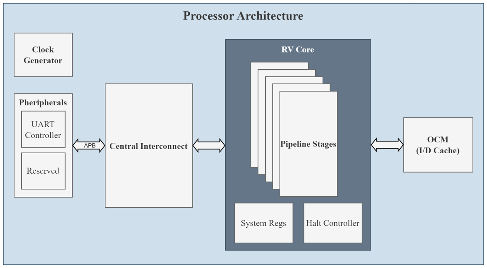

# RISC V Processor


## Tool Required
- Vivado 2024.1

## Steps to build and run
- Clone the Repo
- Open the project
    ```
    ./vivado_prj/risc_xpr
    ```
- Build the code

## RISC V Core
- The source code of the core is available in /src/risc-v/
    ```
    ./src/risc-v/
    ```

## Testbench
- Testbenches are in
    ```
    ./testbench/
    ```